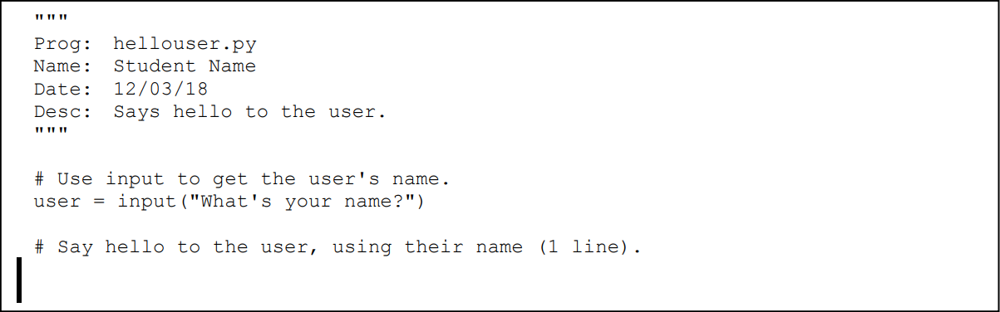

# completeTheCode

One common way of testing programming knowledge is by "completing the code". In this kind of exercise, you will be given a partially-finished program and be asked to fill in the missing pieces. There will usually be clear instructions on what to do - the challenge is using the right commands and syntax.

When completing the code, keep these tips in mind:

- Always read the entire code excerpt before starting.
- **Read the comments** - they are your guide to what the program is meant to do!
- Check for variable names - you may need to create or use variables that are used elsewhere, and the names must match.
- If you get stuck, use the existing code to help you. You may even find the command you need in a different question!

In our exercises, missing code is always marked with black "gutter-marks" in the left margin, to make it clear where you need to complete the code.

## Examples

