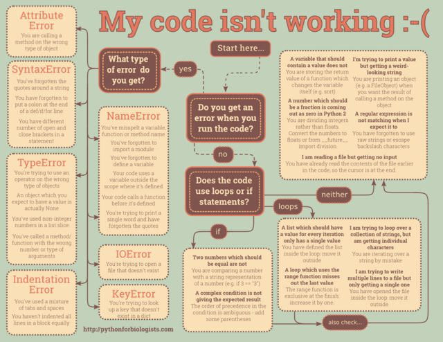

# debugging

No one writes perfect code on the first try. It is rare to write a program and hit "run" and get an expected solution. Testing code is integral to creating a good program. So what happens when something doesn't work as expected?

A bug in a computer program is an error in the code that causes the program to behave in an unexpected way. It is *not* the same as a virus. A bug is usually an unintentional mistake made by the programmer. Glitches are similar, but usually harder to fix. Bugs can cause minor, even fun issues such as glitches in video games ([MissingNo.](https://en.wikipedia.org/wiki/MissingNo.), [Pacman kill screen](https://en.wikipedia.org/wiki/Pac-Man#Kill_screen)), or serious issues and hazards such as causing car accidents ([Toyota accelerators](https://en.wikipedia.org/wiki/2009%E2%80%9311_Toyota_vehicle_recalls)), power outages, failures in air and spacecraft and errors or service outages for banks, stock exchanges and telecommunications networks.

A famous example of a bug includes the [Y2K bug](https://en.wikipedia.org/wiki/Year_2000_problem): most computers before the year 2000 were coded to understand the year as a two digit number (for example, 76 instead of 1976). Most software needed to be updated before the year 2000 to prevent issues from small miscalculations to major economic, governmental or scientific crises. 

## Common Bugs

Sometimes, you complete your code, save it, hit run, and nothing happens. It highlights a line or section of your code in red and pops up some kind of error message. Other times, you can run the code, but at some point it stops running and shows a bunch of red text with an error message in it. Yet still other times, your code doesn't stop, but it doesn't give the answer you expected either. We'll talk about all of these possible issues.

### 1. Typos

Yeah, it can be that simple:
    
    counter = 0
    while counter < 3
        counter = conter + 1
        print (counter)
    print ("I love coding)
    
    Can you find the 3 typos that would prevent the code from running?
    
### 2. Syntax errors
    
    x = 4
    if x = 4:
        print "my number is ", 4
        
 A syntax error (sometimes just a typo) is an error that confuses the computer so that it can't read your code. In the above example, if x = 4: is incorrect syntax.
 What's the correct syntax for the if statement?
 What else is missing?
    
### 3. Forgetting to import a package
    
    diceRoll = randint(1,6)
    print ("you rolled a ", diceRoll)
    
This won't work if you forget to write import random at the top. This is because without importing the random package, randint means nothing to Python. You may need packages for a variety of general and specialised purposes as you continue to code with Python.
    
###4. Type error
    
    x = 5
    y = "kangaroo"
    z = x + y
    
    if 11 > "seven":
        print ("hello")
        
Above, the declaration of z = x + y will cause a problem because you can't add a string and a number. The if condition will also cause a problem.
How can we fix both of these issues?
    
### 5. Overflow

If a number gets too big or too small, it may overflow. This means that the computer has run out of space to store the number. This is an uncommon issue for most of our purposes, as modern computers can handle very large and precise numbers.

Older computers capped out at numbers much lower, though. For example, in Pacman, the maximum level you can reach is 255. If you beat this level, there is no level 256 because the game cannot count any higher. This causes the game to malfunction.
    

### 6. Division by zero
    
    counter = 3
    while counter > 0:
        counter = counter - 1
        print (12 / counter)
        
Try tracing this code. Write down what happens to counter and what is printed each time the while loop runs. Can we prevent the program from dividing by zero?
    
### 7. Off-by-one errors
    
These occur when a loop runs one more or less time than you expect it to. This is actually pretty easy to do. Tracing can help us identify these errors and how to fix them.
    
Trace the code below for the output and values of all variables.
    
    myAge = 5
    counter = 0
    print ("Happy birthday!")
    while counter < myage:
        print ("Are you ",counter, "?")
        counter = counter + 1
    
The idea here is I would like to count up to 5, starting at 1. Does the code do that? How can I modify the code so it does this properly? (There is more than one solution).
    
### 8. Logic Errors
    
Off-by-one errors are just one type of logic error. A logic error is the likely culprit if your code runs and gives you an answer, but it's not what you would expect it to be.
    
eg. Suppose I have designed this simple program to tell me what movies I can see:
    
    age = input("What is your age? ")
    if age > 18:
        print("You can see any movie!")
    elif age < 18 and age > 15:
        print("You are not allowed to see R-rated movies.")
    else:
        print("You are not allowed to see R- or MA 15+ movies.)
        
 - if the user inputs 21, does it give the answer you expect?
 - if the user inputs 18, does it give the answer you expect?
 - if the user inputs 16, does it give the answer you expect?
 - if the user inputs 15, does it give the answer you expect?
 - if the user inputs 12, does it give the answer you expect?
    
Notice how we chose the test cases. We are sure to choose one from each category and the "edge cases" (15  and 18). Edge cases are easy to make mistakes with.
    
See if you can fix this program so it works for all ages.

## Summary

Phew, that was intense. But now you've seen some of the many types of bugs that are common in beginner coding, and you're armed to fix them!

Remember to check for all of the following:
- Did you define all of your variables?
- Did you spell everything correctly?
- Did you include a colon : at the end of all of your if/elif/else/while/for statements?
- Did you remember brackets?
- Did you put quotes around all of your strings?
- Are you using any tools that may require you to import a package?
- Are you mixing data types (eg. are you trying to add "3" + 7)?
- Is everything correctly indented?
- Are you using very very large numbers?
- When you divide, is there any possibiliy that you are dividing by zero?
- Did you test your code for off-by-one, logic, and edge-case errors?

**Read your error messages!** They are confusing at first, but as you solve more problems you will become more familiar with the way the errors are worded.
    

    
    

