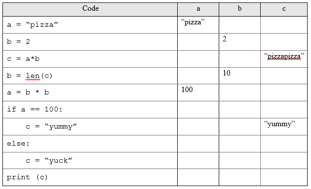
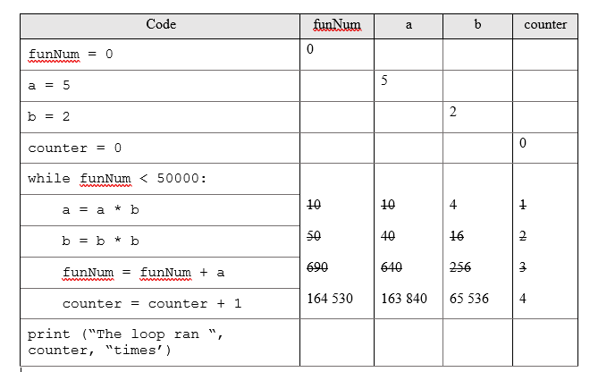

# tracing

Tracing is a valuable skill for a programmer to have. It allows us to check that our code will work as expected in different cases. Tracing is done by hand - no computer required!

To trace code, we read the code line by line and respond as a computer would. As we do this, we keep track of the values of variables and the expected outputs at each stage.

We will use a table to trace code. Note that the value of the variable is listed in the column under its name. Each time the value changes, the new value is written beside the line it was changed in.

## Examples

